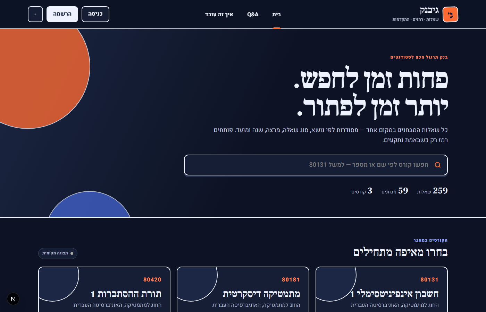

# גיבנק — GBank

> **In English:** GBank is a searchable exam question bank for the Hebrew University
> of Jerusalem. Students can search past exam questions by course, topic and question
> type, see community hints instead of full solutions, track their progress and open
> the original exam scans. It is built with Next.js and Supabase, the interface is
> in Hebrew (RTL), and sign-up is limited to HUJI email addresses. The site also
> works without a database, using the built-in course data.



בנק שאלות למבחני האוניברסיטה העברית: חיפוש לפי נושא ואופי השאלה, רמזים מהקהילה,
שמירת התקדמות וצפייה בסריקות המקור. הפרויקט מגיע עם נתוני בסיס לשלושה קורסים:

- **אינפי 1** (80131): 93 שאלות מ־12 מבחנים.
- **מתמטיקה בדידה** (80181): 28 שאלות מ־3 מבחנים, ועוד 24 מבחנים שמופיעים עדיין
  כשאלון מלא בלבד.
- **תורת ההסתברות 1** (80420): 114 שאלות מ־20 מבחנים.

## יכולות

- ממשק Next.js מלא בעברית וב־RTL, בצבעי כחול כהה, כתום, שמנת ולבנדר, כולל מצב כהה.
- Supabase עבור משתמשים, מסד נתונים, רמזים, לייקים, התקדמות וקובצי PDF.
- הרשמה וכתיבה מוגבלות לכתובות מייל של HUJI.
- מצב מקומי מובנה: האתר עובד מיד עם נתוני הבסיס גם לפני חיבור Supabase.
- כלי ייבוא רב־קורסי שמעלה נתונים וקובצי PDF, ויכול להעביר או למחוק את קובצי המקור
  רק לאחר שהייבוא כולו הצליח.
- Row Level Security במסד הנתונים, וקובצי PDF ב־bucket פרטי עם קישורים זמניים.
- בדיקת build אוטומטית ב־GitHub Actions.

## הרצה מקומית

דרישות: Node.js 22.13 ומעלה.

```bash
npm install
npm run dev
```

פתחו [http://localhost:3000](http://localhost:3000). בלי קובץ `.env.local`, האתר פועל
במצב מקומי: חיפוש, סינון, כל השאלות ושמירת התקדמות בדפדפן עובדים. התחברות, רמזים
משותפים וסנכרון בין מכשירים דורשים Supabase.

בדיקת הפרויקט לפני העלאה:

```bash
npm run check
```

## חיבור Supabase

1. צרו פרויקט חדש ב־Supabase.
2. פתחו את SQL Editor והריצו לפי הסדר את הקבצים
   `supabase/migrations/202609210001_initial_gbank.sql` ולאחריו
   `supabase/migrations/202609260001_huji_only_auth.sql`.
3. תחת **Authentication → Providers → Email** ודאו ש־**Confirm email** פעיל.
   המיגרציה מגבילה הרשמה וכתיבה לכתובות HUJI, ואימות המייל מוכיח שהכתובת אכן
   שייכת למשתמש.
4. העתיקו `.env.local.example` אל `.env.local` ומלאו את שלושת הערכים.
5. ב־Supabase Auth הגדירו את כתובת האתר המקומית ואת כתובת Vercel כ־Redirect URLs.
6. ייבאו את הקורס הראשון (ראו [ייבוא קורסים](#ייבוא-קורסים)).

ה־`SUPABASE_SERVICE_ROLE_KEY` מיועד רק לכלי הייבוא המקומי. אסור להוסיף אותו ל־GitHub,
ל־Vercel או למשתנה שמתחיל ב־`NEXT_PUBLIC_`.

## העלאה ל־Vercel

1. ב־Vercel בחרו **Add New → Project** וחברו את repository `gbank`.
2. הוסיפו רק `NEXT_PUBLIC_SUPABASE_URL` ו־`NEXT_PUBLIC_SUPABASE_ANON_KEY` ב־Environment Variables.
3. בצעו Deploy.
4. הוסיפו את כתובת Vercel ל־Redirect URLs של Supabase Auth.

כל push חדש ל־`main` יוצר deploy חדש. מפתח ה־service role נשאר רק במחשב שמבצע את הייבוא.

## ייבוא קורסים

יש ארבע דרכים להוסיף קורס. כולן רצות רק במחשב של בעל האתר:

| מסלול | פקודה | חילוץ השאלות | מתאים כש… |
| --- | --- | --- | --- |
| Python + Ollama | `python fetch_range.py 80131` | Ollama מקומי, חינם, ישר למסד | רוצים את הדרך הקצרה ביותר |
| Node + OpenAI | `npm run ingest:course` | OpenAI, בתשלום, מדויק יותר | חשוב דיוק בעברית ובנוסחאות |
| Node + Ollama | `npm run ingest:local` | Ollama מקומי, חינם, עם טיוטה | רוצים לבדוק טיוטה בלי לשלם |
| JSON קיים | `npm run import:course` | אין, הקובץ כבר מוכן | כבר יש `course-XXXXX.json` |

ההוראות המלאות, כל האפשרויות ומבנה קובץ ה־JSON נמצאים ב־
[docs/importing-courses.md](docs/importing-courses.md).

## מבנה הפרויקט

```text
app/                    Next.js pages and visual design
components/             Search, filters, cards, hints and authentication UI
data/                   Built-in fallback data for courses 80131, 80181 and 80420
docs/                   Course import guide and screenshot
lib/                    Data adapters, browser database client and local state
scripts/import-course.mjs
scripts/ingest-course.mjs
fetch_range.py          Python: HUJI → Ollama → Supabase בפקודה אחת
requirements-ingest.txt
supabase/migrations/    Database schema, policies and RPC functions
legacy/                 The original one-file prototype and extraction tools
```

## זכויות יוצרים

השאלות נכתבו בידי סגלי הקורסים והזכויות עליהן שמורות לאוניברסיטה העברית. לפני
פרסום רחב של סריקות מלאות, ודאו שקיבלתם הרשאה מתאימה. גיבנק מציג רמזים ולא פתרונות מלאים.
